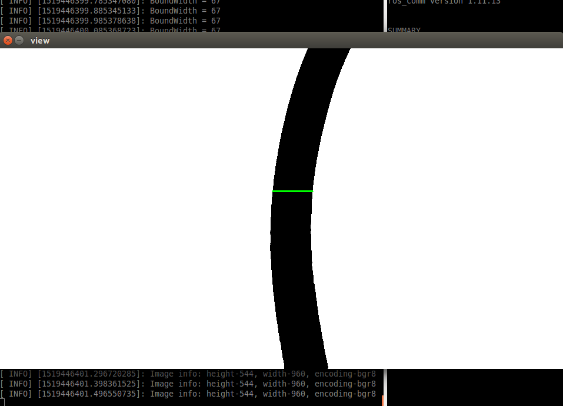

## Author
- **Welin**  2019.05.07

# img_process package

## Description
In this project, the image processing is implemented under ROS architecture and OpenCV library.
The *read_img.cpp* is used to read an input image and do some simple prcessing.
The *show_img.cpp* is used to show the processed image.
In the *script* folder, MATLAB file is also provided to show how it works.

## TODO
```sh
    $ mkdir -p catkin_ws/src
    $ cd catkin_ws/src
```
git clone the project from the corrent URL

```
    $ cd ..
    $ catkin_make
    $ source devel/setup.bash
```

input *rosrun img_process read_img_node argv[1]* to load an image

```
i.e. $ rosrun img_process read_img_node src/img_process/data/test.png
```

rosrun img_process show_img_node is to show the processing above
The effect is shown below:



If running in the matlab environment, it will work like below:


# rgbd_calibration package description

In this project, the kinect-one (RGB-D camera) extern calibration is implemented under ROS architecture and PCL library. Sometimes the kinect is put on the mobile robot. After running the program, we could get the posture of kinect, which could use RVIZ to look up the effect. See detail in the package.

